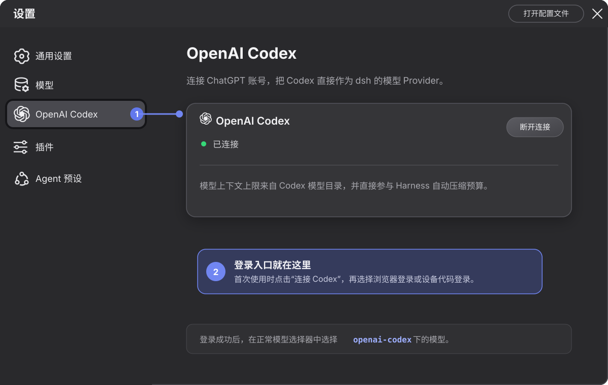

# @jcy2387/dsh-codex-provider-plugin

[English](README.md) | 中文

一个独立发布、可通过 `dsh plugin add` 安装的 OpenAI Codex Provider。它使用 ChatGPT OAuth 登录，通过 Harness 原生 LLM 服务注册 `openai-codex`，并在 Web 设置页提供浏览器登录和设备代码登录。

本包不修改 `deepseek-harness` 源码，也不把 Codex 当作 subagent。Codex 模型仍使用 Harness 的普通 Agent loop、工具、权限、session、流式输出和自动压缩链路。

> 此插件使用 pi-ai 的 `openai-codex` Provider 访问 ChatGPT Codex 后端，不是 OpenAI Platform API Key 集成。接口行为、模型权限和配额由 OpenAI 控制，可能变化。请仅用于符合账号与适用条款的场景。

## 架构

一个 npm 包同时包含两张运行面：

- **Host：** 注册 `openai-codex` LLM adapter，通过 Harness credential provider 保存 OAuth 状态、读取账号用量，并提供插件自有的 loopback-only Connection RPC。
- **Browser：** 通过 `dsh.client` manifest 加载原生设置页，只接收经过校验且不含敏感信息的认证与用量快照；Token 和账号 ID 都不会进入浏览器。

Harness 当前只提供扁平的 Settings section 列表，Models 页面也没有外部内容 Slot。因此插件保持为紧随**模型**之后的独立 **OpenAI Codex** 页面，不修改 Harness，也不做脆弱的 DOM 注入。

`cordis.patch.yml` 只插入一个由本包拥有的插件行。本包不导入或修改 `@deepseek-ai/dsh-api-remotes`，安装时不需要 Harness 增加静态 Remote 注册。

模型 ID、`contextWindow` 和 `maxTokens` 直接来自 pi-ai 的 Codex catalog。Harness 通过正常的 `ctx.llm.resolveModelInfo()` 路径读取这些字段，因此 session 上下文预算和自动压缩不需要 Provider 专属接线。

## 从 npm 安装

```sh
dsh plugin --profile web add @jcy2387/dsh-codex-provider-plugin
dsh web
```

## 设置 OpenAI Codex

> 本插件使用 ChatGPT OAuth 登录，不需要 `OPENAI_API_KEY`，也不是 OpenAI Platform API Key 集成。

设置页大致如下：

<p align="center">
  
</p>

1. 执行 `dsh web` 启动 Web UI。
2. 打开**设置 → OpenAI Codex**，点击**连接 Codex**。
3. 选择**浏览器登录**，使用 ChatGPT 账号完成授权；如果 Host 是无头或远程环境，则选择**设备代码登录**。
4. 状态变为**已连接**后，页面会显示 OpenAI 当前返回的用量周期，并每 60 秒刷新一次。接口没有返回的周期不会显示，插件不会硬编码 5 小时限制。
5. 在正常的模型选择器中选择 `openai-codex` 下的模型。安装插件不会自动修改默认模型。

浏览器登录要求浏览器和 dsh Host 在同一台机器上运行。设备代码登录可能需要先在 ChatGPT 安全设置或工作区权限中启用。账号或工作区必须拥有 Codex 访问权限；模型可用性和配额由 OpenAI 控制。用量数据来自 OpenAI 的 ChatGPT 账号接口，可能随其服务变化。

## 升级

插件按 dsh profile 独立安装。将 `web` profile 中的插件升级到最新已发布版本：

```sh
dsh plugin --profile web update @jcy2387/dsh-codex-provider-plugin --latest
```

也可以安装指定版本：

```sh
dsh plugin --profile web add @jcy2387/dsh-codex-provider-plugin@0.1.0-rc.8 --save-exact
```

确认安装版本后重启 `dsh web`，并在浏览器中强制刷新，避免继续使用旧的客户端 bundle：

```sh
dsh plugin --profile web list @jcy2387/dsh-codex-provider-plugin --depth 0
```

如果从 `deepseek-harness` 源码目录运行，请在这些命令前加上 `pnpm`。

## 本地开发安装

```sh
pnpm install
pnpm run check
dsh plugin --profile web add link:/Users/baojie/Documents/Projects/github/dsh-codex-provider-plugin
dsh web
```

如果从 `deepseek-harness` 源码目录运行，将后两条命令加上 `pnpm` 前缀：

```sh
pnpm dsh plugin --profile web add link:/Users/baojie/Documents/Projects/github/dsh-codex-provider-plugin
pnpm dsh web
```

启动后打开**设置 → OpenAI Codex**，选择浏览器登录或设备代码登录。安装只会新增 Provider，不会自动切换默认模型；请在正常的模型选择器中选择 `openai-codex` 下的模型。

## 配置

所有字段均可省略：

```yaml
- id: llm-openai-codex
  config:
    credentialRef: OPENAI_CODEX_OAUTH
    transport: auto
    streamIdleTimeoutMs: 300000
    ipv6CallbackBridge: true
```

- `credentialRef`：Harness credential provider 中保存序列化 OAuth 状态的引用。
- `transport`：`sse`、`websocket`、`websocket-cached` 或 `auto`。
- `timeoutMs`：Provider 请求超时。
- `websocketConnectTimeoutMs`：WebSocket 建连超时。
- `streamIdleTimeoutMs`：等待下一段流数据的最大空闲时间。
- `retryPolicy`：Harness LLM 的标准重试配置。
- `ipv6CallbackBridge`：浏览器登录期间，临时把 `[::1]:1455` 桥接到 pi-ai 的 `127.0.0.1:1455` 监听器。默认启用；如果部署已经显式管理 `PI_OAUTH_CALLBACK_HOST`，可以关闭。仅关闭桥接时，IPv4 端口可用性检查仍然生效。

## 认证排障

设置页会显示稳定的诊断码，但不会把 OAuth 响应正文或 Token 返回浏览器：

| 诊断码 | 含义与下一步检查 |
| --- | --- |
| `CODEX_AUTH_ACCOUNT_ACCESS` | OpenAI 没有签发可用的 Codex 凭据。检查 MFA、登录时选择的 ChatGPT 工作区和工作区 Codex 权限。 |
| `CODEX_AUTH_BROWSER_CALLBACK` | 授权没有到达 Host。确认浏览器运行在 Host 所在机器，并检查 `localhost:1455` 是否被拦截或占用。默认 IPv6 桥会兼容把 `localhost` 解析为 `::1` 的系统。 |
| `CODEX_AUTH_DEVICE_CODE_DISABLED` | 在 ChatGPT 个人安全设置或工作区权限中启用设备代码登录。 |
| `CODEX_AUTH_NETWORK` | 检查 Host 的代理、DNS、TLS 信任和防火墙能否访问 OpenAI 认证服务。 |
| `CODEX_AUTH_TOKEN_EXCHANGE` | 授权已经返回，但凭据交换失败。重试并检查 Host 系统时间和代理。 |
| `CODEX_AUTH_UNSUPPORTED_REGION` | 浏览器授权已完成，但 Host 网络出口位于 OpenAI 不支持的国家或地区。请让 Host 使用符合 OpenAI 服务范围和条款的网络，再发起一次全新登录。 |
| `CODEX_AUTH_UNKNOWN` | 在同一台 Host 上测试官方 Codex 登录，用于区分账号/环境问题与插件兼容问题。 |

浏览器登录会重定向到 `http://localhost:1455/auth/callback`，因此只适合浏览器和 dsh Host 在同一台机器的场景。启动 pi-ai 前，插件会先确认 `127.0.0.1:1455` 可用；如果已被其他进程占用，会立即以 `CODEX_AUTH_BROWSER_CALLBACK` 失败。浏览器登录进行期间，本插件还会打开一个 IPv6-only 的 `[::1]:1455` 监听器，把原始回调路径和查询参数转发到 IPv4 上的 pi-ai，并在本次登录结束后关闭。它不会监听局域网地址。完整的 provider 异常只保留在 Host 日志中，浏览器只接收上表中的诊断码。无头 Host 应在账号或工作区启用相应权限后使用设备代码登录。参见 [OpenAI Codex 认证文档](https://learn.chatgpt.com/docs/auth)。

## 当前范围

插件包含 Provider、OAuth 生命周期、原生设置 UI、模型目录、压缩使用的上下文元数据和 Codex 用量展示。Host 使用刷新后的 OAuth 凭据请求 `https://chatgpt.com/backend-api/wham/usage`，校验响应后，只通过 loopback-only RPC 返回套餐、用量百分比、重置时间和可选的额度余额。UI 只渲染接口实际返回的周期，因此不会假设存在 5 小时限制。

## 开发

```sh
pnpm install
pnpm run typecheck
pnpm test
pnpm run build
pnpm run publint
```

构建产物：

- `lib/index.js`：Host 插件。
- `lib/client.js`：loader-compatible browser 插件，CSS Modules 已内联。
- `lib/types/**`：Host 与 browser declaration files。
- `cordis.patch.yml`：由 `dsh.bundle` manifest 激活的 profile layer。
